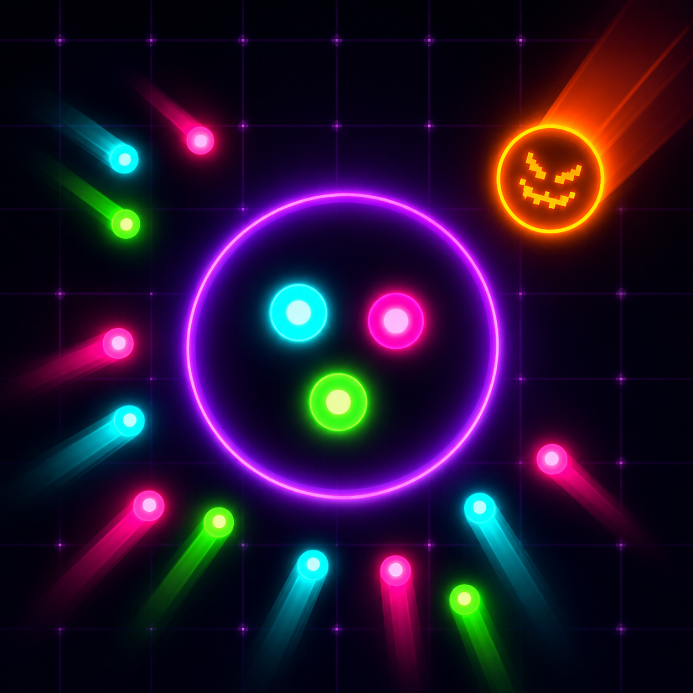

  

  # PARTICLE

  **Guide the swarm. Outsmart the hunters.**

  A neon arcade game for macOS and iPadOS.

  

---

## Overview

Particle is a fast-paced arcade game where you shepherd a swarm of glowing boids into safe zones before the timer runs out — all while predators hunt them down, black holes swallow them whole, and meteor strikes scatter everything you've worked for.

Each wave is harder than the last. Predators get faster and smarter. Safe zones shrink. The chaos escalates.

---

## How to Play

A wave begins with **50 boids** drifting across the playfield. Your job is to herd them all into the glowing **safe zones** before time expires.

- **Hover near boids** to attract them toward you
- **Right-click** to repel them — useful for steering and avoiding predators
- Boids inside a safe zone are scored and protected
- Clear all boids or fill every zone to complete the wave
- Lose a life each time a predator catches a boid

Survive as many waves as you can. The game ends when you run out of lives.

---

## Controls

| Action | macOS |
|---|---|
| Attract boids | Move mouse near them |
| Repel boids | Right-click + drag |
| Fullscreen | `F` key or button (title screen) |
| Quit | `Esc` |

---

## Boid Types

Not all boids behave the same. Each one has a randomly assigned personality that affects how it moves and reacts.

| Type | Appearance | Behaviour |
|---|---|---|
| **Skittish** | Small | Fast, reacts to predators early, hard to herd |
| **Normal** | Medium | Balanced — follows the flock well |
| **Stubborn** | Large | Slow, ignores the flock, wanders alone |

Stubborn boids require individual attention. Don't expect them to follow the group.

---

## Hazards

### Predators
Predators spawn at the screen edge in **ghost mode** — drifting blue and translucent. Once they've been on screen long enough, they **activate** and begin hunting.

- Activated predators target the nearest free boid
- They avoid safe zones but circle just outside them
- Aggressiveness scales with each wave — later predators are significantly faster and predict your movement

### Black Holes
Starting around **wave 3**, a black hole may appear mid-wave. It pulls nearby boids in with gravitational force and destroys anything that gets too close. Keep your swarm away from the edges of its pull radius.

### Meteor Strikes
From **wave 3** onward, there's a chance a neon meteor streaks across the screen and destroys a safe zone — scattering all the boids inside with a burst of outward velocity.

- You'll hear it coming before you see it
- It targets the zone with the most boids
- No lives are lost — if you're fast, you can reposition and re-herd the scattered boids for extra points
- A replacement zone appears a few seconds after impact

---

## Scoring

| Event | Points |
|---|---|
| Boid safely in zone | +5 |
| Time bonus (per second remaining) | +10 |
| Extra life | Every 5,000 points (max 6 lives) |

Clear waves quickly — the time bonus adds up fast.

---

## Tips

- **Keep the swarm together.** Boids flock naturally — a tight group is easier to herd and harder for a single predator to pick apart.
- **Use repel strategically.** Right-clicking pushes boids away from your cursor. Use it to deflect boids away from predators or steer stubborn ones into position.
- **Watch the ghost predators.** Blue drifting predators will activate soon. In later waves the grace period is very short — don't ignore them.
- **Position for the meteor.** When you hear the inbound sound, look for where it's headed. Move near that zone and you can scoop up the scattered boids the moment they burst free.
- **Don't neglect stubborn boids.** They won't follow the flock. Hunt them down individually while the rest of the swarm handles itself.
- **Time bonus is worth chasing.** A fast clear with 40 seconds remaining is worth +400 points — more than clearing an extra 80 boids.
- **Safe zones shrink over time.** By the mid-waves, zones have capacity limits. Split your attention across multiple zones rather than trying to fill one completely before moving on.

---

## Platform

| Platform | Status |
|---|---|
| macOS | Supported |
| iPadOS | In development |
